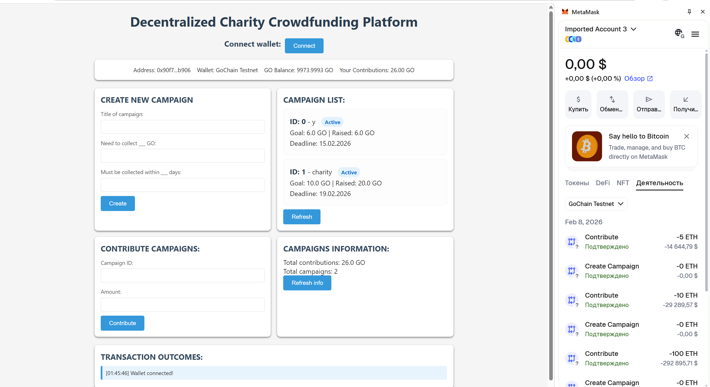
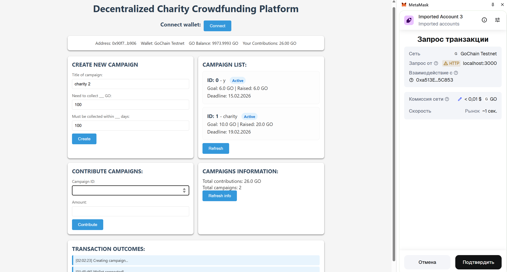
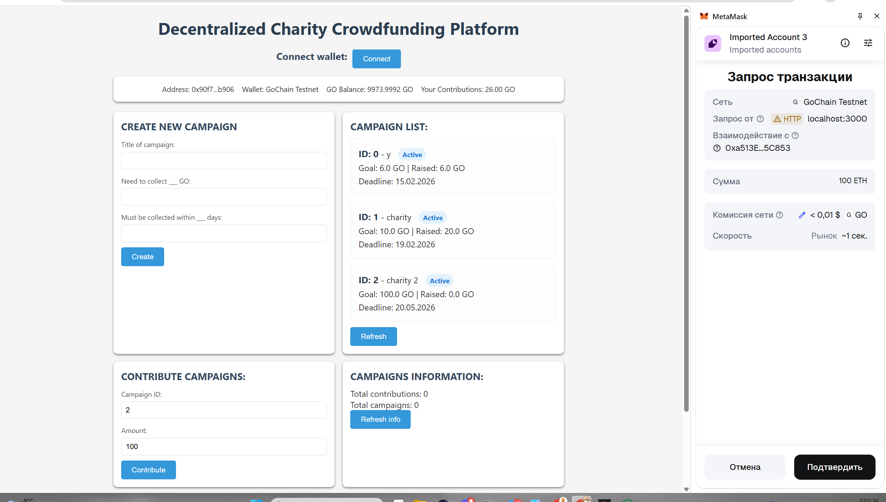

# Decentralized Charity Crowdfunding Platform

## Project Description

This repository contains a decentralized charity crowdfunding application developed as the final examination project for the *Blockchain 1* course.

The project demonstrates the practical use of blockchain technology, smart contracts, ERC-20 tokenization, and MetaMask integration. The application allows users to create charity campaigns, contribute test ETH, and receive reward tokens. All operations are executed on an Ethereum test network using free test tokens only. No real cryptocurrency is used.

## Project Goal

The goal of this project is to design and implement a decentralized application that demonstrates real blockchain interaction. The project focuses on smart contract development in Solidity, frontend-to-blockchain communication using JavaScript, and secure transaction handling via MetaMask.

## System Architecture

The application follows a decentralized architecture. All core logic is implemented in smart contracts deployed on the blockchain, while the frontend serves as a user interface.

User interactions are processed as blockchain transactions. MetaMask is used to connect the wallet, sign transactions, and submit them to the Ethereum test network.

## Smart Contracts Overview

The project includes two main smart contracts.

The **CharityCrowdfunding** contract manages the crowdfunding logic. It allows users to create charity campaigns with a title, funding goal, and deadline. The contract accepts test ETH contributions, tracks individual donations, and finalizes campaigns according to defined conditions.

The **CharityToken** contract is a custom ERC-20 token used as a reward mechanism. Tokens are minted automatically when a user contributes to a campaign. The token has no real monetary value and is used solely for educational purposes.

## Tokenization

Tokenization is implemented using the ERC-20 standard. When a contribution is made, reward tokens are issued to the contributor’s wallet. This mechanism demonstrates token minting and balance tracking without involving real financial assets.

## Frontend and MetaMask Integration

The frontend is implemented as a single-page web application using HTML, CSS, and JavaScript. It allows users to connect their wallet, create campaigns, and contribute test ETH.

MetaMask is used to request access to user accounts, verify the active Ethereum test network, and confirm all blockchain transactions. Every transaction requires explicit user approval through MetaMask.

## Test Network Usage

The application operates exclusively on an Ethereum test network (Sepolia or a local Hardhat network). Only free test ETH is used, which is obtained from public faucets or provided by the local development network. Deployment on the Ethereum mainnet and the use of real cryptocurrency are strictly avoided.

## Repository Structure and File Explanation
blockchain-1-Project/
│
├─ contracts-hardhat/
│ ├─ contracts/
│ │ ├─ CharityCrowdfunding.sol
│ │ └─ CharityToken.sol
│ │
│ ├─ scripts/
│ │ └─ deploy.js
│ │
│ ├─ hardhat.config.js
│ └─ .env (not committed)
│
├─ index.html
├─ script.js
├─ style.css
├─ README.md
└─ .gitignore

---

## Screenshots and Demonstration

### Application Interface

This screenshot shows the main interface of the decentralized charity crowdfunding application. It displays available campaigns and provides the option to contribute test ETH. This screen demonstrates that the frontend is running correctly and connected to the blockchain environment.

### Contribution to a Campaign

This screenshot captures the moment when a user contributes test ETH to an active charity campaign. It demonstrates that the contribution process is initiated from the frontend and sent to the smart contract.

### Successful Transaction Confirmation

This screenshot shows a successfully completed blockchain transaction. It confirms that the contribution was processed on the Ethereum test network and approved via MetaMask. After the transaction, the campaign state is updated, proving real blockchain interaction.
